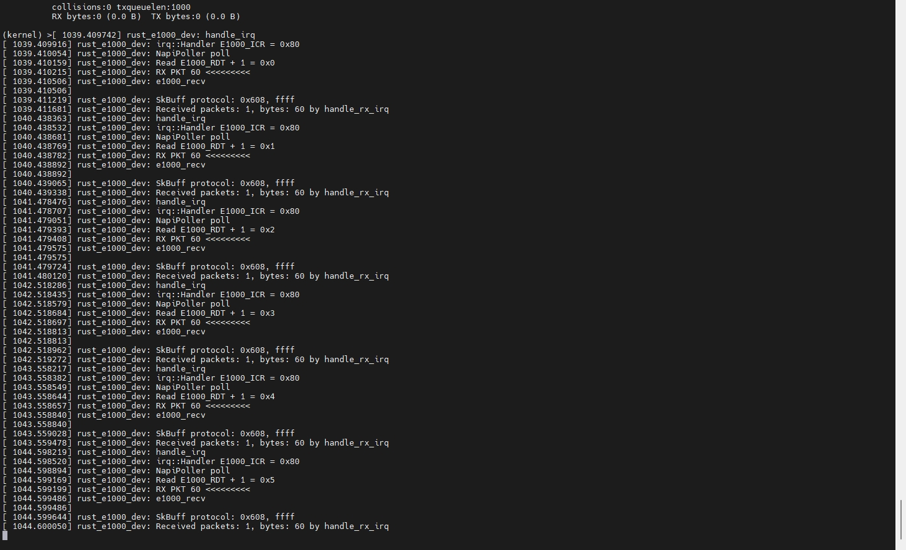

# 完成`e1000`驱动开发的所有`checkpoints`, 成功`ping`通
+ `e1000` 仓库: [neoming_e1000_driver](https://github.com/neoming/e1000-driver/commits/main)

## 实验步骤记录

### 1. 编译不带`e1000`的`linux`内核
在`menuconfig`中按下`/`搜索`e1000`，然后取消勾选即可

### 2. 通过`busybox`制作文件系统
将目标`.ko`拷贝到`_install/home`目录下，然后生成`initramfs.cpio.gz`，并且拷贝`linux`编译后生成的`Image`文件
```shell
#!/bin/bash

rm Image
rm initramfs.cpio.gz
cp ../linux/build/samples/rust/*.ko _install/home/
cp ../e1000-driver/src/e1000_for_linux.ko _install/home/
cd _install
find . -print0 | cpio --null -ov --format=newc | gzip -9 > ../initramfs.cpio.gz
cd ../
cp ../linux/build/arch/arm64/boot/Image Image
```

### 3. 启动qemu
```shell
qemu-system-aarch64 \
  -kernel Image \
  -initrd initramfs.cpio.gz \
  -M virt \
  -cpu cortex-a72 \
  -smp 2 \
  -m 128M \
  -nographic \
  -netdev tap,ifname=tap0,id=tap0,script=no,downscript=no -device e1000,netdev=tap0 \
  -append 'init=/init console=ttyAMA0'
```
### 4. 安装`.ko`并设置ip地址
由于我是用`wsl`进行开发， 所以host端需要设置bridge模式

**host端ip设置**
```shell
sudo ip link add br0 type bridge
sudo ip addr add 192.168.100.50/24 brd 192.168.100.255 dev br0
sudo ip tuntap add mode tap user $(whoami)
ip tuntap show
sudo ip link set tap0 master br0
sudo ip link set dev br0 up
sudo ip link set dev tap0 up
```

**device端ip设置**
```shell
/bin/busybox insmod home/e1000_for_linux.ko

/bin/busybox ip addr add 127.0.0.1/32 dev lo
/bin/busybox ip link set lo up

/bin/busybox ip addr add 192.168.100.223/24 dev eth0
/bin/busybox ip link set eth0 up
```

### 5. 验证`ifconfig`


### 6. 验证`ping`




